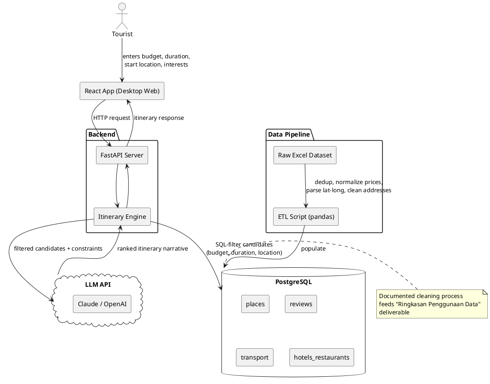

# CLAUDE.md — LocAI Hackathon Project (Del AI Hackathon 2026)

This file gives Claude Code full context on the LocAI project so it can assist effectively across data engineering, backend, frontend, and pitch prep.

Keep updating this file as decisions are made during the project.

> **This is a rebuild.** The original LocAI concept (guide marketplace, hardcoded JSON, mobile-only, no backend) is retired. It didn't fit the panitia's actual dataset — there's no guide-profile data in it. This version is built around the real Toba tourism dataset released for the hackathon.

---

## Build Progress (update this as work is completed)

| Component                               | Status                | Notes                                  |
| --------------------------------------- | --------------------- | -------------------------------------- |
| Requirements & user stories             | ✅ Drafted            | See below — refine as scope firms up   |
| Architecture diagram                    | ✅ Drafted (PlantUML) | See below                              |
| Data audit (known issues doc)           | ✅ Done               | See "Known issues" under Dataset section below |
| ETL pipeline (raw Excel → PostgreSQL)   | ✅ Done               | `scripts/etl.py`; verified row counts, dedup, and needs_review flags against the live DB |
| Database schema                         | ✅ Done               | Created by `scripts/etl.py` (attractions, hotels, restaurants, transport, kuliner, wisata_reviews, resto_hotel_reviews) |
| Backend API (FastAPI)                   | ✅ Done               | `backend/`; `POST /itinerary` + `GET /health`; SQL constraint filter (needs_review excluded) → SEA-LION narrative, grounded via ID lookup |
| RAG / embeddings layer                  | ⏳ Not started        |                                        |
| NLP (review sentiment/topic extraction) | ⏳ Not started        |                                        |
| Frontend (React, desktop-first)         | ✅ Done               | `frontend/` (Vite + React); wired to real `/itinerary`, no mock data; verified in a real browser (Playwright) — see narrative design decision above for the structured-item-first display contract |
| Android port                            | ⏳ Not started        | Target: ASAP after web MVP             |
| Deployment                              | ⏳ Not started        |                                        |

---

## Project Overview

**App Name:** LocAI
**Type:** Web app first (desktop-first, React), Android port to follow soon after the MVP
**Goal:** Help tourists plan a realistic, budget-constrained Lake Toba itinerary — attractions, lodging, food, and transport — grounded entirely in the panitia's real tourism dataset, not invented information.
**Context:** Built for Del AI Hackathon 2026 (Open Challenge Berbasis Data Pariwisata Danau Toba) by a 3-person team.

**One-liner for judges:** _"Tell us your budget, your dates, and where you're starting from — LocAI builds you a real, data-grounded Lake Toba itinerary, not a generic AI travel guess."_

---

## The Problem We're Solving

Tourists planning a trip to Lake Toba face:

- Tourism info scattered across inconsistent, unstructured sources (per the challenge statement's own framing of the dataset)
- No easy way to get a realistic itinerary that respects a specific budget, duration, and starting point
- Difficulty combining attractions + lodging + food + transport into one coherent plan

The panitia's own `prompt` sheet gives concrete example queries this should answer, e.g.:

> _"Saya ingin berlibur ke Danau Toba selama 1 malam. Budget saya sekitar Rp500.000. Saat ini saya berada di Sibolga. Tolong berikan rekomendasi itinerary..."_

Treat the 5 example prompts in that sheet as acceptance tests from day one.

---

## Requirements

### Functional Requirements

- FR1: User can input trip constraints — budget, duration, starting location, interest category (nature/culture/culinary/etc.)
- FR2: System generates an itinerary combining attractions, lodging, food, and transport that fits the budget/duration
- FR3: System displays place details (price, rating, hours, address) sourced from the cleaned dataset — never invented
- FR4: User can browse/filter places by category independent of full itinerary generation
- FR5: System flags or excludes places with missing critical data (price, hours) rather than silently guessing
- FR6: System logs queries so the team can benchmark against the 5 sample prompts from panitia

### Non-Functional Requirements

- NFR1: Frontend — React, desktop-first responsive layout (Android app follows as a near-term second phase, not deferred indefinitely)
- NFR2: Backend — Python + FastAPI
- NFR3: Data storage — PostgreSQL, populated via a documented ETL pipeline from the raw Excel dataset
- NFR4: Itinerary generation response time under ~5s for demo smoothness
- NFR5: No API keys or DB credentials exposed client-side
- NFR6: Data cleaning steps documented (dedup logic, price normalization, address parsing) — feeds directly into the "Ringkasan Penggunaan Data" deliverable
- NFR7: Deployable to a public demo URL for the required demo link

### User Stories

- As a budget-conscious tourist, I want to enter my budget and trip length so that I get an itinerary I can actually afford.
- As a tourist starting from a specific city, I want transport options included so that I know how to get there and between stops.
- As a tourist with specific interests, I want to filter by category (nature, culture, culinary) so that the itinerary matches what I actually want to do.
- As a judge, I want to see how messy source data became a clean, structured dataset so that I can evaluate data engineering quality.

---

## Tech Stack

| Layer           | Tool                                     | Notes                                                                                                                                                                                      |
| --------------- | ---------------------------------------- | ------------------------------------------------------------------------------------------------------------------------------------------------------------------------------------------ |
| Frontend        | React                                    | Desktop-first web app; Android port planned soon after MVP                                                                                                                                 |
| Backend         | Python + FastAPI                         | Chosen over Node.js to maximize genuine use of RAG/ML/NLP libraries (pandas, sentence-transformers, scikit-learn) for the rubric's AI-quality criterion                                    |
| Database        | PostgreSQL                               | Single source of truth — cleaned dataset lives here, not in hardcoded JSON                                                                                                                 |
| AI approach     | RAG (narrate-over-filtered-candidates)   | Backend filters candidates from PostgreSQL by budget/duration/location first (SQL), then an LLM ranks and writes the itinerary narrative over that filtered set — not open-ended retrieval |
| NLP             | Review sentiment/topic extraction        | Applied to the ~26,000 reviews across `wisata-v2` and `resto-hotel-v2` to enrich place profiles (keeps a real NLP technique in scope)                                                      |
| Geospatial      | Distance/route calc from lat-long        | Used for "how far is this from my last stop" — legitimate use of the Geospatial AI category the challenge doc explicitly lists                                                             |
| LLM API         | SEA-LION (`aisingapore/Gemma-SEA-LION-v4-27B-IT`) | OpenAI-compatible API at `https://api.sea-lion.ai/v1` — use the `openai` Python client pointed at this `base_url`, auth via `LLM_API_KEY` bearer token, model id from `LLM_MODEL`. Called only server-side, never from frontend. Rate limit: 10 requests/minute — backend must handle 429s (backoff/retry, not a hard crash). |
| Hosting         | TBD (Vercel-style auto-deploy preferred) |                                                                                                                                                                                            |
| Version Control | GitHub                                   | Claude Code commits and pushes on request                                                                                                                                                  |

**Explicitly not using:** Computer vision / CNN — no image data exists in the dataset, so it wouldn't be a genuine fit and would read as tech-stuffing to judges.

---

## Architecture



**Key architectural decision:** the LLM narrates _on top of_ a SQL-filtered candidate set, rather than doing open-ended retrieval over the whole dataset. This keeps results grounded (no hallucinated places/prices), keeps the system debuggable, and still gives a real RAG story for the pitch.

**Narrative design decision (Phase 2):** SEA-LION's `narrative`/`summary` text is instructed to refer to picks generically by role ("your morning transport", "the first attraction", "day 2's accommodation") rather than naming them — the verified name/price/address lives only in the structured `attractions`/`meals`/`lodging`/`transport` fields, resolved from the DB by id. This exists because an earlier prompt version let the LLM name places directly in prose, which occasionally introduced small transcription mismatches (e.g. narrative said "Mobil KBT" when the structured pick was "Mobil KPT") — a real but different place, so it read as a factual error even though the structured data was correct. **Consequence for Phase 3 frontend:** render the structured item (name, price, address) first/prominently; treat `narrative` as connective/context text underneath, not as the source of truth for what was picked. Verified across all 5 sample prompts (10 day-narratives) with zero place names leaking into narrative text.

---

## Dataset (raw source: `data/raw/Dataset_Tourism.xlsx`, 14 sheets)

> Row counts below are from the actual audited file (2026-07-17), not estimates. An earlier draft of this table had much larger numbers (990/13,671/2,672/etc.) that didn't match the real file — corrected here. `BUILD_PLAYBOOK.md`'s Phase 1 verify numbers were already correct.

| Sheet                                                                                                      | Rows               | Contents                                                                         |
| ------------------------------------------------------------------------------------------------------------ | ------------------ | --------------------------------------------------------------------------------- |
| `wisata-metadata`                                                                                            | 139                | Attractions: id, name, type, entry fee, lat-long, hours, address, rating, status |
| `wisata-v2`                                                                                                  | 12,691             | Raw reviews on attractions (~69% exact-match to a metadata place name)          |
| `hotel-metadata`                                                                                             | 36                 | Lodging: price, facilities, address, lat-long, rating — includes miscategorized rows (see below) |
| `resto-metadata`                                                                                             | 148                | Restaurants: price, menu, facilities, address, lat-long, rating                  |
| `resto-hotel-v2`                                                                                             | 9,611              | Raw reviews on hotels/restaurants                                                 |
| `hotel-resto-v1`                                                                                             | 9                  | Earlier/messier duplicate version — tiny, superseded by resto-hotel-v2/metadata, not ingested |
| `tempat-wisata-v1`                                                                                           | 96                 | Earlier/messier duplicate of attractions — 89/94 names exact-match wisata-metadata; merge+dedupe with fuzzy match for the rest |
| `transportasi`                                                                                               | 16                 | Angkot/boat routes, prices, hours                                                 |
| `kuliner`                                                                                                    | 12                 | Local food descriptions (not tied to specific restaurants)                       |
| `Attractions Info`, `Artikel Danau Toba`, `Info Seputar Danau Toba (TOP 3)`, `waktu operasional destinasi`  | small, messy headers | Curated reference/article sheets — real header row isn't row 0; out of scope for Phase 1 schema, revisit if time allows for RAG background context |
| `prompt`                                                                                                     | 5 example prompts (real header starts row 2) | **Use these as acceptance tests**                        |

**Known issues to document in the ETL writeup** (also required by the challenge doc's "Known Issues" guidance):

- Duplicate places across v1/v2 sheet pairs (e.g. one exact intra-sheet duplicate in `wisata-metadata` itself — "Bukit Tara Bunga" appears twice with near-identical lat-long)
- `resto-metadata` has one name-duplicate ("Family Resto") that is actually two different branches at different addresses — a trap for naive name-based dedup; only `wisata-metadata`+`tempat-wisata-v1` are deduplicated per the Phase 1 spec, hotels/restaurants are not
- Inconsistent price formats: ranges like "5.000 - 10.000" vs single numbers ("100000") vs special values ("Gratis" = free, "Sukarela" = donation-based, not zero) vs a range separator that's actually a Unicode en-dash "–" wrapped in non-breaking spaces in some `resto-metadata` rows (renders as "�" in some terminals/fonts — not corruption, just `\xa0`/`–`)
- `hotel-metadata` has miscategorized rows: several entries named like lodging (e.g. "Tabo Cottages", "Thyesza Hotel Resort") are tagged `place-type = "Restoran"`, and one row ("Hotel and Restaurant Singgalang") has `place-type = "China"` (corrupted/meaningless) — reclassify by `place-type` value, flag the unclear one instead of guessing
- Missing/inconsistent lat-long, hours, ratings on some entries
- Free-text addresses that need parsing/geocoding

---

## Competition Context (Del AI Hackathon 2026)

- Open challenge — team defines its own problem/user/solution as long as it (1) is relevant to Toba tourism, (2) meaningfully uses the panitia dataset, (3) is demoable as a prototype
- Scoring (100 pts): problem framing (20), impact/relevance (20), **AI/data engineering quality (20)**, feasibility (15), meaningful dataset use (15), communication/demo (10)
- Preliminary round deliverables: Deskripsi Proyek, Slide Pitching, Video Demo & Evaluasi Model (5-10 min), Repositori/Artefak Teknis, Ringkasan Penggunaan Data, Rencana Implementasi
- Submission artifacts: `[NamaTim]-LaporanAnalisis.pdf` (max 25MB, no institution name), public demo link (no faces/institution identity), source code `.zip`
- No personal/sensitive data use, no scraping outside source terms, external data must cite source/license and can't replace the panitia dataset
- Team: max 3 people, one team per person

---

## What NOT to Build (carried over, still valid)

- Real payment processing
- Full user authentication system (unless genuinely needed for the demo story)
- Anything requiring live guide/operator coordination (no such data exists)
- Computer vision / CNN features (no image data to justify it)

---

## Environment Variables

```
DATABASE_URL=postgresql://...
LLM_API_KEY=your_key_here            # SEA-LION bearer token, server-side only
LLM_BASE_URL=https://api.sea-lion.ai/v1
LLM_MODEL=aisingapore/Gemma-SEA-LION-v4-27B-IT
```

Never commit these. Use `.env` locally (gitignored) and the hosting platform's environment variable settings for deployment.

---

## Next Steps

1. Data audit — go sheet by sheet, write up known issues (feeds "Known Issues" + "Ringkasan Penggunaan Data")
2. Design PostgreSQL schema (unified `places` table + category-specific tables, `reviews`, `transport`)
3. Build ETL script (pandas) to clean and load the dataset
4. Build FastAPI endpoints: constraint-filter query + itinerary generation
5. Build React frontend (desktop-first)
6. Test against the 5 sample prompts
7. Begin Android port
8. Record demo video, write LaporanAnalisis.pdf, prep pitch deck
