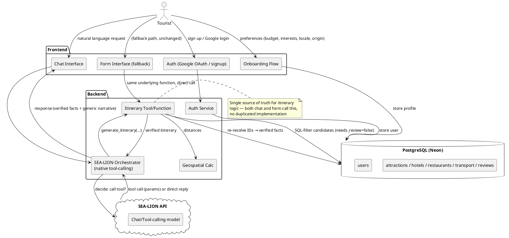

# CLAUDE.md — LocAI Hackathon Project (Del AI Hackathon 2026)

This file gives Claude Code full context on the LocAI project. Keep updating it as decisions are made.

> **Status: Phases 1-5b complete and verified** (ETL, backend, frontend, geospatial distance + locale-tone, chat interface over the existing `/itinerary` logic, voice input/output). Project has since expanded scope per mentor direction: chatbot-first interface, onboarding flow, auth, and a knowledge-retrieval layer. The original form-based itinerary tool is being kept as a working fallback throughout — nothing gets removed as new layers are added.
>
> **Timeline:** Preliminary round deadline is August 2, 2026. As of this update, ~9 days remain. Written deliverables (LaporanAnalisis.pdf, Ringkasan Penggunaan Data, Rencana Implementasi, slide deck, video demo) are NOT part of the code build and must be progressing in parallel — they are required for submission regardless of app polish.

---

## Build Progress

| Component                                        | Status                             | Notes                                                                                                                                                                                                   |
| ------------------------------------------------ | ---------------------------------- | ------------------------------------------------------------------------------------------------------------------------------------------------------------------------------------------------------- |
| Requirements & user stories                      | ✅ Done                            |                                                                                                                                                                                                         |
| Architecture diagram                             | ✅ Done                            | See below, updated for chatbot layer                                                                                                                                                                    |
| Data audit                                       | ✅ Done                            |                                                                                                                                                                                                         |
| ETL pipeline                                     | ✅ Done                            | 143 attractions, 33 hotels, 151 restaurants, 16 transport, 12 kuliner, ~22k reviews                                                                                                                     |
| Database schema                                  | ✅ Done                            | `source_sheets`, `needs_review` on every table                                                                                                                                                          |
| Backend API — form-based                         | ✅ Done                            | `/itinerary`, `/health` — KEPT as fallback, do not remove                                                                                                                                               |
| LLM integration (SEA-LION)                       | ✅ Done                            | Structured RAG. **Correction:** our configured model (`Gemma-SEA-LION-v4-27B-IT`) does NOT have native structured `tool_calls` — verified directly against docs.sea-lion.ai/guides/tool_calling, which documents three models: `Llama-SEA-LION-v3-70B-IT` (full OpenAI-style `tool_calls`), `Gemma-SEA-LION-v4-27B-IT` (ours — text-based: emits a fenced ` ```tool_code ` block like `func(arg=val)` in `content`, no native `tool_calls`), `Llama-SEA-LION-v3.5-70B-R` (reasoning, no tool support at all). **No v4.5 model appears in that doc** — stop referencing it until someone finds where it's documented. We stayed on v4-27B for consistency with the rest of the app and parse its text convention safely (`ast.parse`/`ast.literal_eval`, never `eval`) in `backend/chat.py`. |
| Anti-hallucination (ID re-resolution)            | ✅ Done                            | Carries over into chat, must not be weakened by new layers                                                                                                                                              |
| Frontend — form-based                            | ✅ Done                            | Kept as explicit fallback UI                                                                                                                                                                            |
| Geospatial distance                              | ✅ Done                            | Haversine + hardcoded hub lookup, "don't guess" fallback verified                                                                                                                                       |
| Locale-tone dropdown                             | ✅ Done — interim source           | Verified: narrative-only, structured data byte-identical across locales. Will become an override on top of onboarding-stored preference once Phase 6 lands — see "Locale: single source of truth" below |
| Map (click-to-show distance line)                | ✅ Done (per last build)           | Leaflet + OSM, labeled as straight-line distance, not a road route                                                                                                                                      |
| **Chatbot orchestrator (SEA-LION tool-calling)** | ✅ Done                            | `POST /chat`, `backend/chat.py`; one tool (`generate_itinerary`) that calls `build_itinerary()` directly — same function `/itinerary` uses, no duplicated SQL-filter/ID-resolution logic. Missing-info → clarifying question, never a guessed default (verified live). PDF export (`backend/pdf_export.py`, fpdf2) is pure formatting from the last verified itinerary in chat history — no extra LLM call. Chat reply text reuses the itinerary's own already-constrained `summary`/`narrative` rather than a fresh free-form paraphrase, so it inherits the same anti-hallucination guarantee without a second uncontrolled generation step. |
| **Voice input/output (Phase 5b)**                | ✅ Done                            | `frontend/src/voice.js` + `ChatView.jsx`; Web Speech API, no backend changes. Mic permission requested only on mic-button click (verified: zero SpeechRecognition activity from page load or from turning voice mode on alone). Voice mode is additive -- typing always works; toggle only adds a mic button + auto-speak. **Finding:** only `indonesian` narrative text is actually Bahasa Indonesia (see `LOCALE_TONE_INSTRUCTIONS` in `backend/llm.py`) -- every other locale writes English with a regional tone. A locale→voice map that only tries native-language voices (as literally suggested, e.g. "vietnamese → vi-VN") would read that English text with e.g. a Vietnamese voice and mispronounce it if one happens to be installed. Fixed by making voice selection follow the actual language of the text, not the locale's name: `indonesian` tries its real language voice; the other five never attempt a native-language voice at all (confirmed the naive "try native first" version still had the bug -- on a machine that genuinely has e.g. a Vietnamese voice installed, it would find it and use it to read the English text, which is worse than falling back since it looks like it worked), only a regionally-flavored English voice if the browser happens to expose one, then any English voice, then the browser's own default. Verified with every native-language voice simultaneously "installed" (mocked): only `indonesian` picks its native voice, the other five always resolve to English regardless of what else is available. Fallback is never silent: console-logged as `[voice] locale="X" requested~"Y" -> using "Z"` plus a `(FALLBACK: ...)` suffix, and shown in a UI status line under the chat input. Also found and fixed: the voice decision must be reported as soon as it's picked, not gated on the utterance's `onend` -- a `speak()` call issued after an async network round-trip (as opposed to a synchronous user-gesture handler) didn't reliably fire completion events in testing, which would otherwise leave the status line stuck forever. **Second finding (caught via real Filipino speech input during manual testing):** speech RECOGNITION needs the opposite mapping from speech OUTPUT -- the user speaks their own regional language regardless of what language the bot's text reply is in, so reusing the English-preferring `LOCALE_VOICE_LANG` for `recognition.lang` meant a Filipino-locale user speaking Tagalog got recognized as `en-PH` (English) and came out garbled. Split into a separate `LOCALE_RECOGNITION_LANG` table that prefers the real regional language for every locale (`filipino` → `fil-PH`, not `en-PH`); `LOCALE_VOICE_LANG` for TTS output is unchanged. |
| **Interactive preference onboarding**            | ⏳ Next                            | Replaces single form with conversational/quiz-style flow; becomes primary source of locale once built                                                                                                   |
| **Login/signup + "Continue with Google"**        | ⏳ Next                            |                                                                                                                                                                                                         |
| **Vector DB + embeddings (Local AI Agent)**      | ⏳ Later — real new infrastructure | SEA-LION Embedding model exists and is usable; scope this carefully given time left                                                                                                                     |
| Full UI/UX rebrand (branding, template)          | ⏳ Last                            | Polish, sequenced after function                                                                                                                                                                        |
| Booking agent                                    | ❌ Deferred                        | Explicitly out of scope for hackathon — document in Rencana Implementasi                                                                                                                                |
| NLP review sentiment/topic extraction            | ⏳ Stretch goal, not started       | ~22k reviews still unused for this                                                                                                                                                                      |
| Deployment                                       | ⏳ Not started                     |                                                                                                                                                                                                         |
| Android port                                     | ⏳ Not started                     |                                                                                                                                                                                                         |

---

## Project Overview

**App Name:** LocAI
**Type:** Web app first (desktop-first, React), Android port to follow
**Goal:** Help tourists plan a realistic, budget-constrained Lake Toba itinerary, grounded entirely in the panitia's real tourism dataset — now accessible through a conversational chat interface as the primary experience, with the original form kept as a fallback.

**One-liner for judges:** _"Tell LocAI's AI chatbot your budget, dates, and where you're starting from — it builds a real, data-grounded Lake Toba itinerary, verified fact-by-fact against our database, not an AI guess."_

---

## Revised Architecture Direction (per mentor input)

The mentor proposed a multi-agent architecture: LLM Orchestrator → Itinerary Agent / Local AI Agent / Booking Agent, backed by a Vector Database + Embedding Model, with a web-search fallback. Translated into concrete build decisions:

- **Orchestrator + Itinerary Agent → built now.** The orchestrator calls a single tool (`generate_itinerary`) that wraps the _existing, already-verified_ itinerary logic — not a rebuild, the SQL filtering and ID-resolution anti-hallucination pipeline are reused as-is via a direct function call. **Correction to an earlier claim in this doc:** our configured model, `Gemma-SEA-LION-v4-27B-IT`, does not have OpenAI-style native `tool_calls` — per docs.sea-lion.ai/guides/tool_calling it emits a text-based ` ```tool_code ` block instead, which `backend/chat.py` parses safely via Python's `ast` module. There is no v4.5 model documented for tool-calling; only `Llama-SEA-LION-v3-70B-IT` has full native `tool_calls` support, but switching to it now would be a bigger, unasked-for change and would break narrative-tone consistency with the rest of the app, so we stayed on v4-27B.
- **LangChain vs. direct tool-calling:** the mentor's diagram specifies LangChain. Decision made here: use **SEA-LION's native tool-calling directly** rather than adding LangChain as a framework layer. Reasoning: LangChain adds abstraction and dependency overhead that isn't necessary to achieve the same agentic behavior, and time is the binding constraint. The resulting behavior (LLM decides to call a tool, tool executes, LLM responds using the result) is the same "agentic" pattern the mentor described — the framework choice is an implementation detail, not a scope reduction. Revisit only if there's spare time later.
- **Booking Agent → explicitly deferred**, not needed for the hackathon per team decision.
- **Local AI Agent + Vector DB + Embeddings → real new infrastructure, sequenced last (before UI rebrand only).** SEA-LION does have a genuine Embedding model line, so this is technically buildable, not just aspirational — but it is the highest-effort, highest-risk remaining item given the timeline. If time runs short, document this fully in Rencana Implementasi as the planned next phase instead of shipping a rushed/incomplete version.
- **Web search fallback → not building.** Same reasoning as the deferred open-chatbot decision earlier in the project: an ungrounded external data source reintroduces hallucination/reliability risk. Can be mentioned as future work.
- **Voice input/output → built as Phase 5b**, directly after the chatbot, since it's a thin presentation layer on top of `/chat` with no new backend dependency. See Tech Stack and Build Playbook for detail.

---

## Locale: single source of truth (important — avoid duplicate/conflicting state)

The locale value (SEA origin, or "Others") is used by THREE features: narrative tone (Phase 4), voice output (Phase 5b), and the onboarding flow (Phase 6). These must not become three separate, potentially-conflicting inputs. Correct data flow:

- **Before onboarding exists (now through Phase 5b):** the standalone locale dropdown built in Phase 4 is the only source -- now literally one piece of React state lifted to `App.jsx`, passed down as controlled props to both `ItineraryForm` (its existing "Narrative tone" field) and `ChatView` (a matching dropdown next to the voice-mode toggle, which is also what voice output reads). Selecting a locale in either tab updates the other (verified). Keep it working as-is.
- **Once onboarding (Phase 6) exists:** locale becomes part of the user's stored profile, collected once during onboarding. It should pre-fill and drive both narrative tone and voice output automatically for that user, without needing to re-select it every session.
- **The Phase 4 dropdown does not get deleted** — keep it visible as a quick per-session override (e.g. "trying it in a different locale right now"), but it should read its default from the onboarding-stored profile value when one exists, not the other way around.
- When Phase 6 is built, explicitly update the locale-tone and voice logic to read from the user's profile first, falling back to the standalone dropdown's manual selection only if no profile value is set (e.g. guest/anonymous use).

---

## AI Architecture — be precise about this in the report

Core principle, unchanged since Phase 2, and must be preserved as the chatbot layer is added:

1. User intent (via chat OR the fallback form) → constraints extracted (budget, duration, start location, interests, locale)
2. **SQL filtering** in PostgreSQL — the real "retrieval" step, exact relational queries, not semantic/embedding search (this is why it's called **structured RAG**, distinct from vector RAG)
3. Filtered candidates (with DB IDs) → SEA-LION, which ranks and writes narrative (or, in chat mode, decides to call the itinerary tool with extracted parameters)
4. **Every fact resolved back from PostgreSQL by ID before reaching the user** — names/prices/addresses are never trusted from model output directly
5. Narrative refers to items generically, not by restating specific names, avoiding transcription mismatches

**This must hold true in the chat interface exactly as it does in the form interface** — the chatbot is a new front door onto the same verified pipeline, not a new, less-verified pipeline.

If/when the vector DB + Local AI Agent is added later, it introduces genuine semantic/vector retrieval for general knowledge questions (e.g. "tell me about Batak funeral customs") that the structured tables can't answer — this is a second, separate retrieval path, and should not replace or weaken the SQL-based path used for itinerary generation.

---

## Requirements

### Functional Requirements

- FR1: User can input trip constraints via chat OR the fallback form — budget, duration, starting location, interest category
- FR2: System generates an itinerary combining attractions, lodging, food, and transport that fits budget/duration
- FR3: System displays place details sourced from the cleaned dataset — never invented
- FR4: User can browse/filter places by category independent of full itinerary generation
- FR5: System flags (`needs_review`) rather than guesses at uncertain data, excluded from recommendations by default
- FR6: System logs queries and is benchmarked against the 5 sample prompts
- FR7: System shows distance from the user's start location to each recommended place (when resolvable)
- FR8: System adjusts narrative tone/language based on the user's selected SEA locale — sourced from onboarding-stored preference once Phase 6 exists, falling back to the standalone dropdown otherwise (single source of truth, see below)
- **FR9 (new): Users can converse with a chatbot to get an itinerary, with the same guarantees as the form**
- **FR10 (new): Users can complete an interactive, conversational preference-onboarding flow instead of filling a static form, including selecting their SEA locale/origin (or "Others")**
- **FR11 (new): Users can sign up/log in, including via Google OAuth**
- **FR12 (later): Users can ask general knowledge questions about the Toba region, answered via vector-retrieval over the dataset (Local AI Agent)**
- **FR13 (new): Users can speak to and hear from the chatbot via voice, using the same locale value that drives narrative tone**

### Non-Functional Requirements

- NFR1: Frontend — React (Vite), desktop-first
- NFR2: Backend — Python + FastAPI
- NFR3: Database — PostgreSQL (Neon)
- NFR4: Itinerary generation response time under ~5s
- NFR5: No API keys/credentials exposed client-side
- NFR6: Data cleaning steps documented
- NFR7: Deployable to a public demo URL
- NFR8: SEA-LION rate limit (10 req/min) handled via backoff
- **NFR9 (new): The original form-based itinerary flow must remain fully functional as a fallback at all times — new features are additive, not replacements, until proven stable**
- **NFR10 (new): Auth tokens/sessions handled securely server-side; no credentials in frontend code**
- **NFR11 (new): Voice uses the browser's built-in Web Speech API — no new paid dependency; must fall back gracefully if a locale's voice isn't available on the current system**

### User Stories

- As a tourist, I want to just chat naturally about my trip so that I don't have to fill out a form.
- As a tourist, I want the app to ask me about myself in a friendly, step-by-step way when I first sign up, so that planning feels personal rather than like paperwork.
- As a tourist, I want to sign in with my Google account so that I don't need to create a new password.
- As a tourist, I want to see how far each recommended place is from my starting point.
- As a tourist from a specific SEA locale, I want the itinerary's tone to feel familiar.
- As a tourist, I want to talk to and hear from the chatbot by voice, in a voice that matches my chosen locale, instead of only typing.
- As a tourist, I want to ask general questions about Toba culture/history, not just get itinerary items. _(Local AI Agent — later)_
- As a judge, I want to see how messy source data became a clean, structured dataset.

---

## Tech Stack

| Layer              | Tool                                                                                               | Notes                                                                                     |
| ------------------ | -------------------------------------------------------------------------------------------------- | ----------------------------------------------------------------------------------------- |
| Frontend           | React + Vite                                                                                       | Desktop-first; chat UI as new primary entry, form kept as fallback                        |
| Backend            | Python + FastAPI                                                                                   |                                                                                           |
| Database           | PostgreSQL (Neon)                                                                                  |                                                                                           |
| Auth               | Google OAuth 2.0 + standard email/password signup                                                  | Server-side session handling                                                              |
| AI approach        | Structured RAG + native tool-calling for chat orchestration                                        | Not using LangChain — see "Revised Architecture Direction" for reasoning                  |
| LLM API            | SEA-LION (`aisingapore/Gemma-SEA-LION-v4-27B-IT`), OpenAI-compatible endpoint, text-based tool-calling (not native `tool_calls` — see LLM integration note above) | Rate limit: 10 req/min, backoff implemented                                               |
| Embeddings (later) | SEA-LION Embedding model                                                                           | For Local AI Agent / vector DB, not yet built                                             |
| Vector DB (later)  | TBD (e.g. pgvector extension on existing Neon Postgres — avoids standing up a separate DB)         | Recommend pgvector to reuse existing infrastructure rather than adding a new service      |
| Geospatial         | Haversine + hardcoded hub lookup table                                                             |                                                                                           |
| Map                | Leaflet + OpenStreetMap                                                                            | Free, no API key                                                                          |
| Voice              | Browser Web Speech API (SpeechRecognition + SpeechSynthesis)                                       | Free, no API key; voice selection driven by the same locale value used for narrative tone |
| Version Control    | GitHub                                                                                             |                                                                                           |
| Hosting            | TBD                                                                                                |                                                                                           |

**Explicitly not using:** Computer vision/CNN, vector RAG for itinerary generation itself (kept as SQL-based), LangChain (using SEA-LION's native tool-calling instead), a general open web-search fallback, a Booking Agent (deferred).

---

## Architecture



_(Local AI Agent / vector DB / Booking Agent intentionally omitted from this diagram until built — add when scoped.)_

---

## Dataset (verified via ETL, unchanged from Phase 1)

| Table               | Final rows | Notes                                           |
| ------------------- | ---------- | ----------------------------------------------- |
| attractions         | 143        | 92 exact-name duplicates merged, 0 fuzzy merges |
| hotels              | 33         | 1 `needs_review` (corrupted `place_type_raw`)   |
| restaurants         | 151        | 5 `needs_review` (implausible prices)           |
| transport           | 16         | No coordinates — excluded from distance feature |
| kuliner             | 12         | No price column in source                       |
| wisata_reviews      | 12,691     | 28.8% unmatched to a place                      |
| resto_hotel_reviews | 9,611      | 4.0% unmatched to a place                       |

---

## Competition Context (Del AI Hackathon 2026)

- Scoring (100 pts): problem framing (20), impact/relevance (20), **AI/data engineering quality (20)**, feasibility (15), meaningful dataset use (15), communication/demo (10)
- Preliminary deliverables: Deskripsi Proyek, Slide Pitching, Video Demo & Evaluasi Model (5-10 min), Repositori/Artefak Teknis, Ringkasan Penggunaan Data, Rencana Implementasi
- Submission: `[NamaTim]-LaporanAnalisis.pdf` (max 25MB, no institution name), public demo link, source code `.zip`
- Team: max 3 people

---

## What NOT to Build (for the hackathon)

- Real payment processing
- Booking Agent (deferred to Rencana Implementasi)
- Open web-search fallback for grounding (ungrounded external data reintroduces hallucination risk)
- Computer vision / CNN
- LangChain framework layer (using SEA-LION native tool-calling instead)

---

## Environment Variables

```
DATABASE_URL=postgresql://...
LLM_API_KEY=your_key_here
LLM_BASE_URL=https://api.sea-lion.ai/v1
LLM_MODEL=aisingapore/Gemma-SEA-LION-v4-27B-IT
GOOGLE_OAUTH_CLIENT_ID=...
GOOGLE_OAUTH_CLIENT_SECRET=...
SESSION_SECRET=...
```

Never commit these. `.env` is gitignored; `.env.example` holds the template only.

---

## Next Steps (in priority order, per team decision)

1. ~~**Chatbot orchestrator**~~ ✅ Done — `POST /chat` wraps the existing itinerary logic via a single tool; form kept fully functional as fallback (verified side by side in browser)
2. ~~**Voice input/output (Phase 5b)**~~ ✅ Done — Web Speech API (STT + TTS), locale now a single shared state read by both the form and chat; see Build Progress row above for the English-narrative-vs-native-voice finding
3. **Interactive preference-onboarding flow** — conversational/quiz-style, replacing the static form for initial input; becomes the primary source of the user's locale (see "Locale: single source of truth")
4. **Login/signup + Google OAuth**
5. **Vector DB + embeddings (Local AI Agent)** — scope carefully; document as future work in Rencana Implementasi if time runs short
6. **Full UI/UX rebrand** — branding assets, template, polish
7. Deployment
8. Android port
9. Written deliverables (LaporanAnalisis.pdf, Ringkasan Penggunaan Data, Rencana Implementasi — including Booking Agent + full multilingual chatbot as documented future work, slide deck, video demo) — **must run in parallel with the above, not after**
