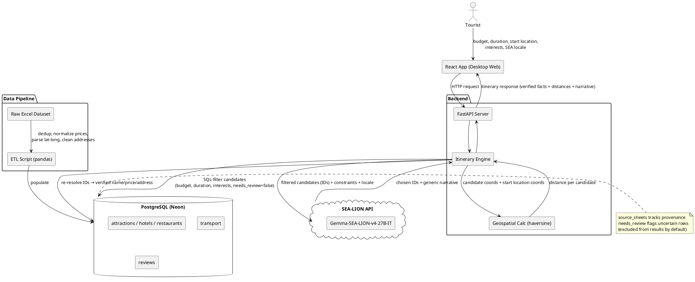

# CLAUDE.md — LocAI Hackathon Project (Del AI Hackathon 2026)

This file gives Claude Code full context on the LocAI project. Keep updating it as decisions are made.

> **Status: Phases 1-4 complete and verified.** ETL, backend, frontend, geospatial distance, and locale-tone dropdown all work end-to-end against the real dataset. Next: deployment.

---

## Build Progress

| Component                               | Status                                   | Notes                                                                                                     |
| --------------------------------------- | ---------------------------------------- | --------------------------------------------------------------------------------------------------------- |
| Requirements & user stories             | ✅ Done                                  |                                                                                                           |
| Architecture diagram                    | ✅ Done                                  | PlantUML, see below                                                                                       |
| Data audit                              | ✅ Done                                  | Real record counts, dedup overlap, entity-link gaps all quantified                                        |
| ETL pipeline (raw Excel → PostgreSQL)   | ✅ Done                                  | 143 attractions, 33 hotels, 151 restaurants, 16 transport, 12 kuliner, ~22k reviews                       |
| Database schema                         | ✅ Done                                  | `source_sheets` (provenance) and `needs_review` (flag, don't guess) on every table                        |
| Backend API (FastAPI)                   | ✅ Done                                  | `/itinerary`, `/health`; SQL-filters before any LLM call                                                  |
| LLM integration (SEA-LION)              | ✅ Done                                  | Structured RAG — SQL retrieval, not vector/embedding retrieval (see AI Architecture below)                |
| Anti-hallucination (ID re-resolution)   | ✅ Done                                  | Every name/price/address re-verified against DB post-generation                                           |
| Frontend (React, desktop-first)         | ✅ Done                                  | Structured data primary, narrative secondary; loading/error states tested                                 |
| **Geospatial distance feature**         | ✅ Done                                  | `backend/locations.py`; haversine + exact-match-only hub lookup (21 hubs); unrecognized start_location → no distance data, never a guess |
| **Locale-tone dropdown**                | ✅ Done                                  | `backend/llm.py` `LOCALE_TONE_INSTRUCTIONS`; verified `req.locale` is referenced nowhere in `candidates.py` (SQL filtering unaffected); verified via comparison test that facts stay identical across locales |
| NLP (review sentiment/topic extraction) | ⏳ Not started                           | Scoped as stretch goal — ~22k unused reviews available if time allows                                     |
| Deployment                              | ⏳ Not started                           | Next major phase after the two features above                                                             |
| Android port                            | ⏳ Not started                           | After deployment is stable                                                                                |
| Open-ended SEA-LION chatbot             | ❌ Deferred — not building for hackathon | See "Deferred: Full Chatbot" below — documented as post-hackathon roadmap in Rencana Implementasi instead |

---

## Project Overview

**App Name:** LocAI
**Type:** Web app first (desktop-first, React), Android port to follow
**Goal:** Help tourists plan a realistic, budget-constrained Lake Toba itinerary — attractions, lodging, food, transport — grounded entirely in the panitia's real tourism dataset.

**One-liner for judges:** _"Tell us your budget, your dates, and where you're starting from — LocAI builds a real, data-grounded Lake Toba itinerary, verified fact-by-fact against our database, not an AI guess."_

---

## AI Architecture — be precise about this in the report

This is **structured RAG**, not classic vector-embedding RAG:

1. User submits constraints (budget, duration, start location, interests)
2. **Backend filters candidates via SQL** — this is the "retrieval" step, done with exact relational queries (budget ≤, category match), not semantic/embedding search
3. Filtered candidates (with DB IDs) + constraints → sent to SEA-LION
4. SEA-LION returns: which candidate IDs to use per day, plus narrative text
5. **Backend re-resolves every ID against PostgreSQL before responding** — name, price, address always come from the database, never trusted from the model's text output
6. Narrative text refers to items generically ("your morning transport", "lunch stop") rather than restating specific names, to avoid transcription mismatches between narrative and structured data

**Why this matters for judges:** the correct claim is "the AI's factual claims are never trusted — only its IDs and narrative framing are used, and IDs are re-verified," not simply "the AI doesn't hallucinate." Use the precise version.

**Known limitation:** feasibility check required an explicit fix — `NULL`-priced rows were trivially passing budget filters (e.g. Rp500 budget returning `feasible: true`). Fixed by requiring the cheapest _known_-price option per required category to actually fit.

---

## New Features (this build phase)

### 1. Geospatial distance

- Dataset has real lat/long on `attractions`, `hotels`, `restaurants` (confirmed: Toba-region coordinates, ~2.3–2.8°N, 98–99°E)
- `transport` currently stores origin/destination as text only, no coordinates — out of scope for distance calc unless a lookup is added later
- Distance = haversine formula, no external API/library needed
- User's start location: **use a hardcoded lookup table** of known Toba-region towns/hubs (Medan, Sibolga, Parapat, Balige, Silangit airport, Tuktuk, etc. — ~15-20 entries) mapped to coordinates. Do not add a live geocoding API — unnecessary dependency for a regionally-scoped app.
- Display: "X km from [start location]" per recommended place

### 2. Locale-tone dropdown (cheap chatbot alternative)

- **Not a new chatbot.** A dropdown next to the itinerary form/results (similar UX to a model-picker dropdown) where the user selects their SEA origin/locale
- Selected locale is passed into the existing narrative-generation system prompt as a parameter — SEA-LION adjusts tone/phrasing/language accordingly
- This uses SEA-LION's actual claimed differentiator (SEA language/dialect training) in a way that's demonstrable, rather than just asserted in the pitch
- No new hallucination surface — this only affects narrative tone, not structured facts, so it doesn't touch the anti-hallucination guarantees above

### Deferred: Full open-ended chatbot

Explicitly **not building** a separate open-ended "ask anything" chatbot for the hackathon. Reasoning:

- It reintroduces hallucination risk the planner specifically eliminated — an open Q&A surface needs its own grounding/verification pipeline, not just a UI addition
- Dialect/locale quality across SEA is unverified in this timeframe — a bad live answer in front of judges costs more credibility than not having the feature
- Competes directly for time against guaranteed-value, required deliverables (deployment, LaporanAnalisis.pdf, Ringkasan Penggunaan Data, Rencana Implementasi, slide deck, demo video)

**Action:** document this as planned post-hackathon work in **Rencana Implementasi** — full credit for the idea, none of the execution risk.

---

## Requirements

### Functional Requirements

- FR1: User can input trip constraints — budget, duration, starting location, interest category
- FR2: System generates an itinerary combining attractions, lodging, food, and transport that fits budget/duration
- FR3: System displays place details (price, rating, hours, address) sourced from the cleaned dataset — never invented
- FR4: User can browse/filter places by category independent of full itinerary generation
- FR5: System flags (`needs_review`) rather than guesses at places with missing/implausible critical data, and excludes them from recommendations by default
- FR6: System logs queries and is benchmarked against the 5 sample prompts from panitia
- **FR7 (new): System shows distance from the user's start location to each recommended place**
- **FR8 (new): System adjusts narrative tone/language based on a user-selected SEA locale**

### Non-Functional Requirements

- NFR1: Frontend — React (Vite), desktop-first
- NFR2: Backend — Python + FastAPI
- NFR3: Data storage — PostgreSQL (Neon), populated via a documented ETL pipeline
- NFR4: Itinerary generation response time under ~5s for demo smoothness
- NFR5: No API keys or DB credentials exposed client-side
- NFR6: Data cleaning steps documented — feeds "Ringkasan Penggunaan Data"
- NFR7: Deployable to a public demo URL
- NFR8: SEA-LION rate limit (10 req/min) handled via exponential backoff — already implemented

### User Stories

- As a budget-conscious tourist, I want to enter my budget and trip length so that I get an itinerary I can actually afford.
- As a tourist starting from a specific city, I want transport options included so that I know how to get there and between stops.
- As a tourist with specific interests, I want to filter by category so that the itinerary matches what I actually want to do.
- **As a tourist, I want to see how far each recommended place is from my starting point so that I can judge how practical the plan is.**
- **As a tourist from a specific SEA locale, I want the itinerary's tone/language to feel familiar so that the experience feels less generic.**
- As a judge, I want to see how messy source data became a clean, structured dataset so that I can evaluate data engineering quality.

---

## Tech Stack

| Layer           | Tool                                                                          | Notes                                                                      |
| --------------- | ----------------------------------------------------------------------------- | -------------------------------------------------------------------------- |
| Frontend        | React + Vite                                                                  | Desktop-first; run via `npm run dev`, NOT Live Server/other static servers |
| Backend         | Python + FastAPI                                                              |                                                                            |
| Database        | PostgreSQL (Neon)                                                             | Single source of truth                                                     |
| AI approach     | Structured RAG (SQL retrieval + SEA-LION narration)                           | See AI Architecture section                                                |
| LLM API         | SEA-LION (`aisingapore/Gemma-SEA-LION-v4-27B-IT`), OpenAI-compatible endpoint | Rate limit: 10 req/min — backoff implemented                               |
| Geospatial      | Haversine formula + hardcoded location lookup table                           | No external geocoding API                                                  |
| Version Control | GitHub                                                                        | Claude Code commits and pushes on request                                  |
| Hosting         | TBD (Vercel-style preferred)                                                  | Phase after current features                                               |

**Explicitly not using:** Computer vision/CNN (no image data). Vector-embedding RAG (SQL retrieval is more precise for numeric/categorical constraints like budget). A general-purpose open chatbot (deferred, see above).

---

## Architecture



---

## Dataset (source: `Dataset_Tourism.xlsx`, verified via ETL)

| Table               | Final rows | Notes                                                                                                                     |
| ------------------- | ---------- | ------------------------------------------------------------------------------------------------------------------------- |
| attractions         | 143        | Merged from wisata-metadata (139) + tempat-wisata-v1 (96), 92 exact-name duplicates merged                                |
| hotels              | 33         | 1 flagged `needs_review` (corrupted `place_type_raw = "China"`)                                                           |
| restaurants         | 151        | 5 flagged `needs_review` (implausible prices, likely missing trailing zero, e.g. "18.00" → probably "18.000")             |
| transport           | 16         | Ferry routes split into origin/destination; ambiguous multi-city angkot routes correctly left unsplit rather than guessed |
| kuliner             | 12         | No price column in source — left untouched, no fabricated field added                                                     |
| wisata_reviews      | 12,691     | 8,736 exact match, 302 fuzzy match, 3,653 (28.8%) unmatched to a place                                                    |
| resto_hotel_reviews | 9,611      | 8,249 exact, 980 fuzzy, 382 (4.0%) unmatched                                                                              |

**Entity resolution note:** all 92 attraction merges were exact-normalized-name matches — 0 came from the fuzzy fallback, so there's no false-positive merge risk to spot-check there. Fuzzy matching is used more heavily (and with real risk) in review-to-place linking.

---

## Competition Context (Del AI Hackathon 2026)

- Open challenge — team defines its own problem/user/solution as long as it (1) is relevant to Toba tourism, (2) meaningfully uses the panitia dataset, (3) is demoable as a prototype
- Scoring (100 pts): problem framing (20), impact/relevance (20), **AI/data engineering quality (20)**, feasibility (15), meaningful dataset use (15), communication/demo (10)
- Preliminary deliverables: Deskripsi Proyek, Slide Pitching, Video Demo & Evaluasi Model (5-10 min), Repositori/Artefak Teknis, Ringkasan Penggunaan Data, Rencana Implementasi
- Submission: `[NamaTim]-LaporanAnalisis.pdf` (max 25MB, no institution name), public demo link, source code `.zip`
- Team: max 3 people, one team per person

---

## What NOT to Build

- Real payment processing
- Full user authentication system (unless genuinely needed for the demo story)
- Anything requiring live guide/operator coordination (no such data exists)
- Computer vision / CNN features (no image data to justify it)
- **Open-ended chatbot** (deferred — see above)

---

## Environment Variables

```
DATABASE_URL=postgresql://...
LLM_API_KEY=your_key_here
LLM_BASE_URL=https://api.sea-lion.ai/v1
LLM_MODEL=aisingapore/Gemma-SEA-LION-v4-27B-IT
```

Never commit these. `.env` is gitignored; `.env.example` holds the template only.

---

## Next Steps

1. Build geospatial distance feature (haversine + location lookup table)
2. Build locale-tone dropdown (SEA locale parameter → narrative system prompt)
3. Full end-to-end test with both new features, using the 5 sample prompts
4. Deploy (Vercel + Neon)
5. Begin Android port
6. Write LaporanAnalisis.pdf, Ringkasan Penggunaan Data, Rencana Implementasi (include deferred chatbot here), slide deck, demo video
